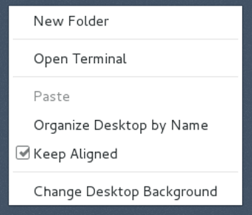
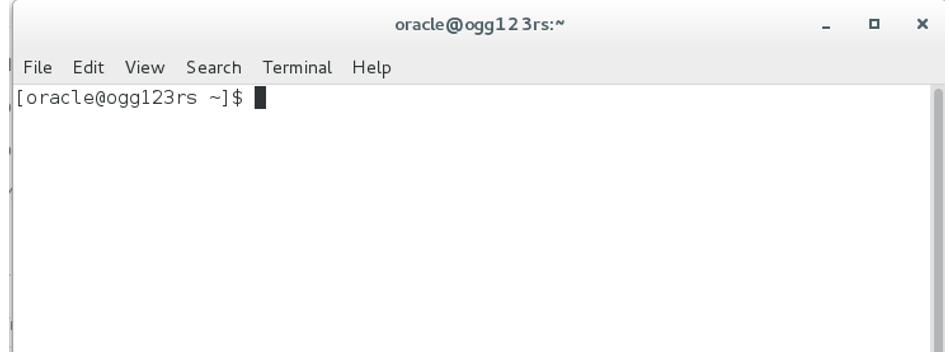
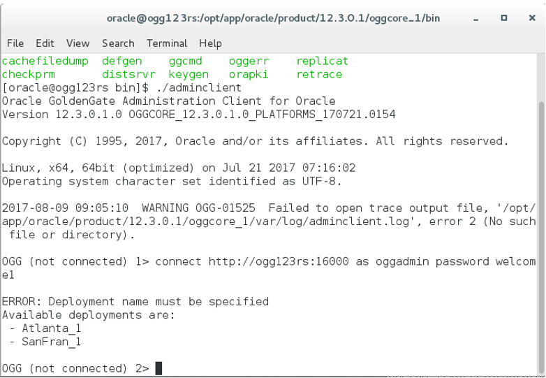
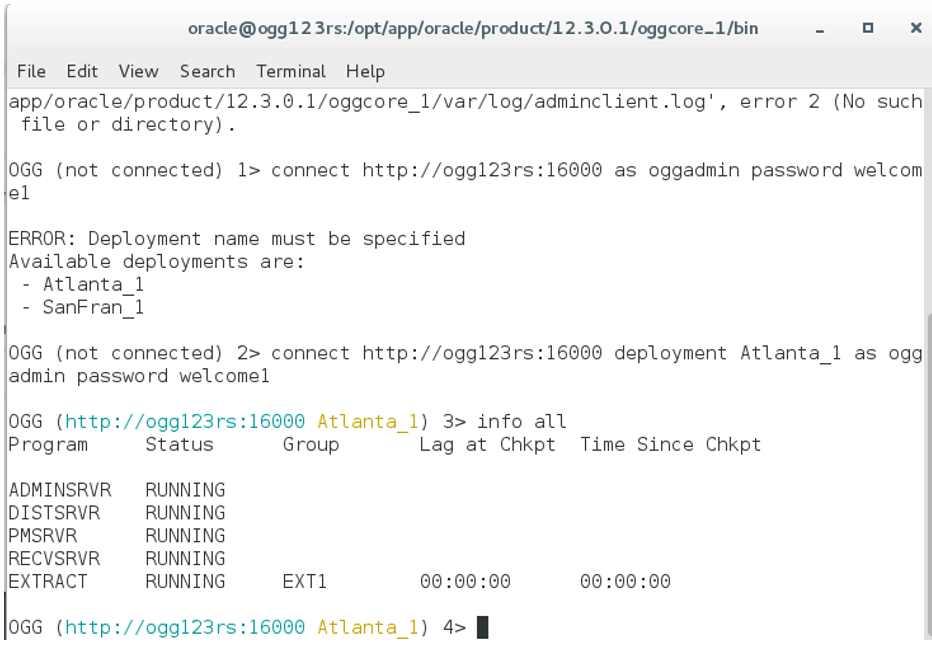
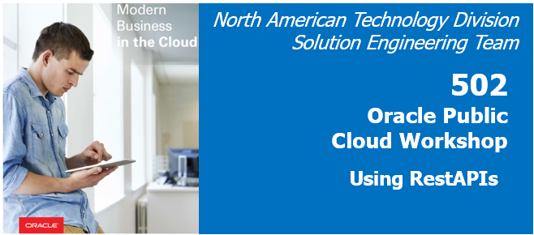

Update August 20 2018

## CONNECT AND INTERACT WITH ADMINCLIENT
## Introduction

In this lab, you will take a look at how to connect and interact with the Microservices AdminClient. using Goldengate 12.3 micro services web interface in a Ravello environment.

Steps:
1. Open a command terminal
Right mouse click -> Open Terminal

2. Navigate to the Oracle GoldenGate 12.3 binary directory
cd /opt/app/oracle/product/12.3.0.1/oggcore_1/bin

3. Start the AdminClient
./adminclient

4. Connect to Oracle GoldenGate without a deployment

OGG 1> connect http://hostname:16000 as oggadmin password welcome1

Notice that you are not connected and that AdminClient provides you a list of deployment you can attempt to connect to.

5. Connect to an Oracle GoldenGate deployment

OGG 2> connect http://hostname:16000 deployment Atlanta_1 as oggadmin password welcome1

6. Perform an “info all” command and other GoldenGate commands to see what
AdminClient can do

OGG Atlanta_1 3> info all

Note: checkout the RLWRAP function as well (arrow up and down while in AdminClient)

At this point, you should have a fully functional Admin Client environment. 

## Working with REST API
## Introduction

In this lab, you will take a look at how to pull a list of services from Oracle GoldenGate using the REST APIs. Replace <port> with the port number of the service you want to access.

Steps:
1. Open a command window (right mouse click – Open Terminal)

2. Try running the following CURL command

curl -u oggadmin:welcome1 -H "Content-Type: application/json" -H "Accept:
application/json" -X GET http://hostname:<port>/services/v2/deployments/SanFran_1/services/distsrvr/logs |
python -mjson.tool

3. Retrieve Log locations using the following CURL command

curl -u oggadmin:welcome1 -H "Content-Type:application/json" -H
"Accept:application/json" -X GET http://hostname:<port>/services/v2/logs | python - mjson.tool

Appendix:

A: Run Swingbench
Steps:
1. Open a command terminal and navigate to the Swingbench bin directory

cd /opt/app/oracle/product/swingbench/bin

2. Execute the swingbench command

./swingbench

3. Once Swingbench starts, select the SOE_Server_Side_V2 configuration file.

4. Once Swingbench is open, update Password, Connect String, Benchmark and Run Time
Password: welcome1
Connect String: //hostname/pdb1
Benchmark Run Time: 10 mins

5. Execute Swingbench

At this point you should see activity on the table by looking at the Extract/Replicats.
Correct any problems that may arise due.

At this point, you should have a fully functional REST Api environment. 

## Working with mySQL
## Introduction

In this lab, you will take a look at how to pull a list of services from Oracle GoldenGate using mySQL.

Steps:
1. Connect to mySQL using Putty

