## CONNECT AND INTERACT WITH ADMINCLIENT
## Introduction

In this lab, you will take a look at how to connect and interact with the Microservices AdminClient. using Goldengate 12.3 micro services web interface in a Ravello environment.

Steps:
1. Open a command terminal
Right mouse click -> Open Terminal

2. Navigate to the Oracle GoldenGate 12.3 binary directory
cd /opt/app/oracle/product/12.3.0.1/oggcore_1/bin

3. Start the AdminClient
./adminclient

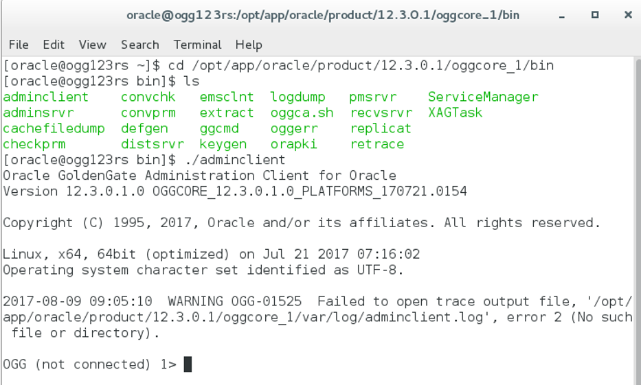

4. Connect to Oracle GoldenGate without a deployment

OGG 1> connect http://hostname:16000 as oggadmin password welcome1

Notice that you are not connected and that AdminClient provides you a list of deployment you can attempt to connect to.

5. Connect to an Oracle GoldenGate deployment

OGG 2> connect http://hostname:16000 deployment Atlanta_1 as oggadmin password welcome1

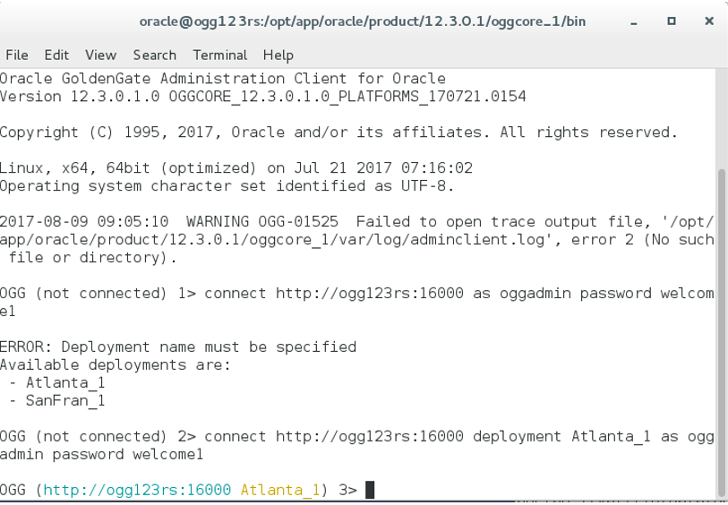

6. Perform an “info all” command and other GoldenGate commands to see what
AdminClient can do

OGG Atlanta_1 3> info all

Note: checkout the RLWRAP function as well (arrow up and down while in AdminClient)

At this point, you should have a fully functional Admin Client environment. 

## Working with REST API
## Introduction

In this lab, you will take a look at how to pull a list of services from Oracle GoldenGate using the REST APIs. Replace <port> with the port number of the service you want to access.

Steps:
1. Open a command window (right mouse click – Open Terminal)

2. Try running the following CURL command

curl -u oggadmin:welcome1 -H "Content-Type: application/json" -H "Accept:
application/json" -X GET http://hostname:<port>/services/v2/deployments/SanFran_1/services/distsrvr/logs |
python -mjson.tool

3. Retrieve Log locations using the following CURL command

curl -u oggadmin:welcome1 -H "Content-Type:application/json" -H
"Accept:application/json" -X GET http://hostname:<port>/services/v2/logs | python - mjson.tool

Appendix:

A: Run Swingbench
Steps:
1. Open a command terminal and navigate to the Swingbench bin directory

cd /opt/app/oracle/product/swingbench/bin
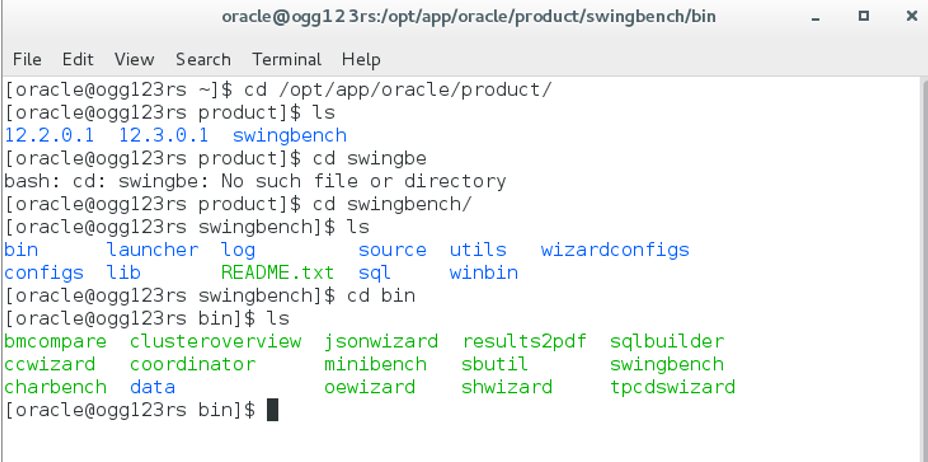

2. Execute the swingbench command

./swingbench
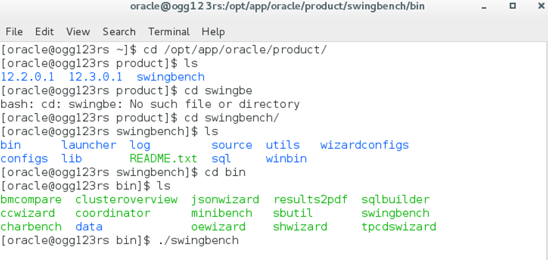

3. Once Swingbench starts, select the SOE_Server_Side_V2 configuration file.

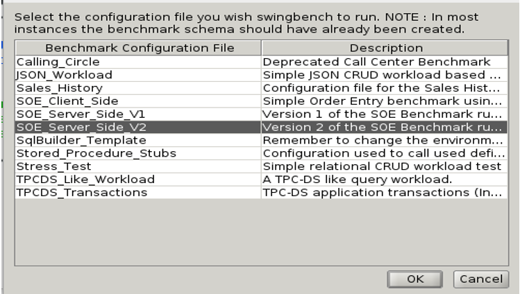

4. Once Swingbench is open, update Password, Connect String, Benchmark and Run Time:

Password: welcome1 --
Connect String: //hostname/pdb1 --
Benchmark Run Time: 10 mins

adjust parameters for generating records

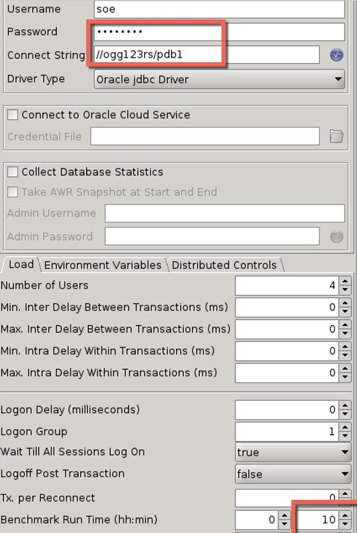

5. Execute Swingbench

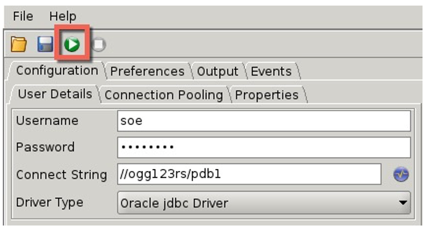

At this point you should see activity on the table by looking at the Extract/Replicats.
Correct any problems that may arise due.

At this point, you should have a fully functional REST Api environment. 

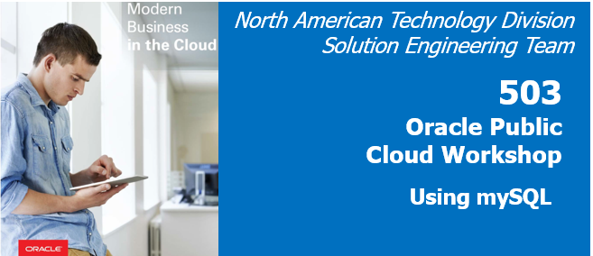

## Working with mySQL
## Introduction

In this lab, you will take a look at how to pull a list of services from Oracle GoldenGate using mySQL.

Steps:

Set up Goldengate Extract on the source MYSQL DB

1.	Connecting to ravello instance from putty , Once you start the MYSQL instance IP address will appear

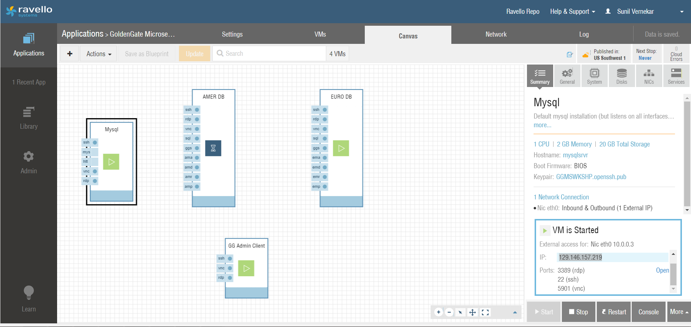

2.	You would need the private key file to connect the instance

3.	Load the private key in the putty

4.	Log in as user ‘ravello’

5.	Golden gate instance is already installed and set up for the MYSQL DB in /opt/gg4mysql/

6.	Both extract and pump process is already been set up. You need to add the remote host ip address in the PUMP parameter file. You can find the remote host ip from the EURO instance and the MGRPORT would be target receiver server port

7.	You can load the test tables with the below scrip in the location /home/ravello/sql

8.	Once you load the table check the stats of the extract

9.	On the target EURO instance make sure all the processes are running 

10. If you check in receiver server there will not be any paths before you start the pump on the source side.

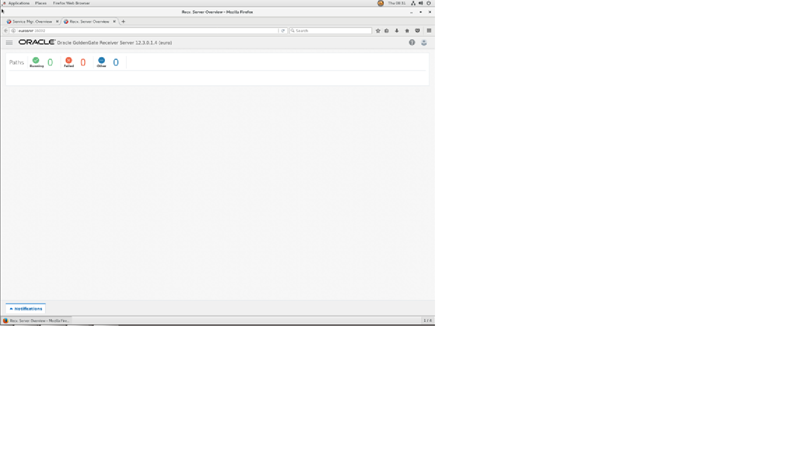

11.	Once the pump is started on the source side you will see a path created

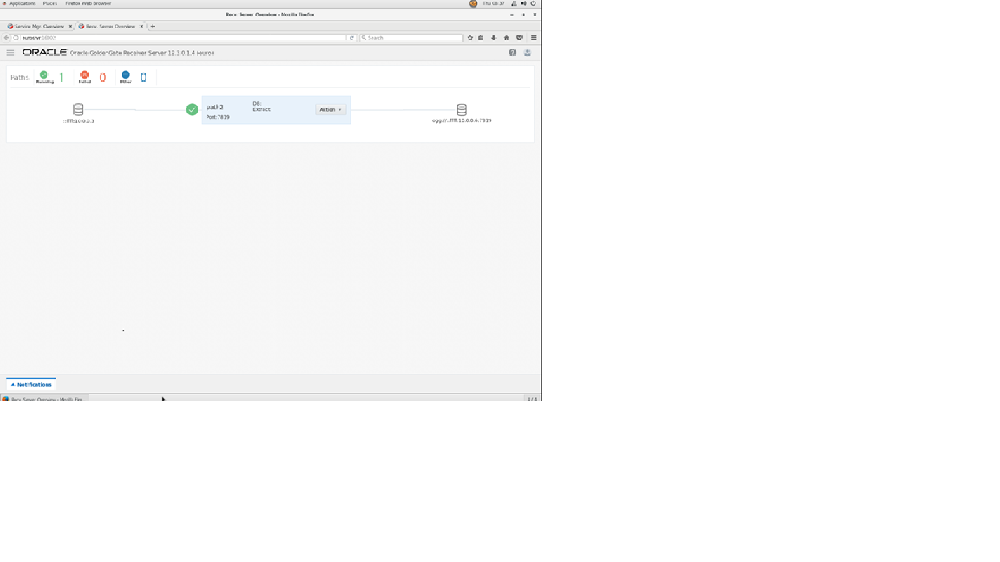

12.	You can check the trail files on the system as well

13.	Now go to administrative server CONFIGURATION tab

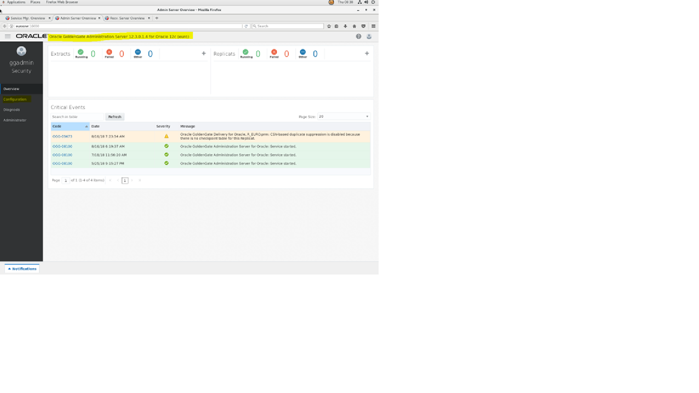

14.	You can add DB credentials there which will be used by Replicat process

15.	Now connect to DB with the credential created

16.	Then you can create a checkpoint table in the DB

17.	Now go to Overview tab to create the replicat

18.	Select the type of the replicat

19.	Complete all the details

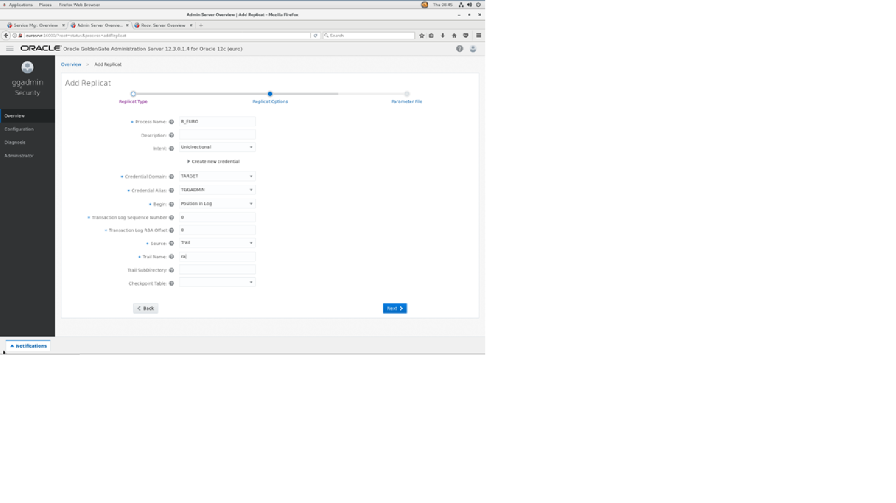

20.	You can manually change the parameter file before creating

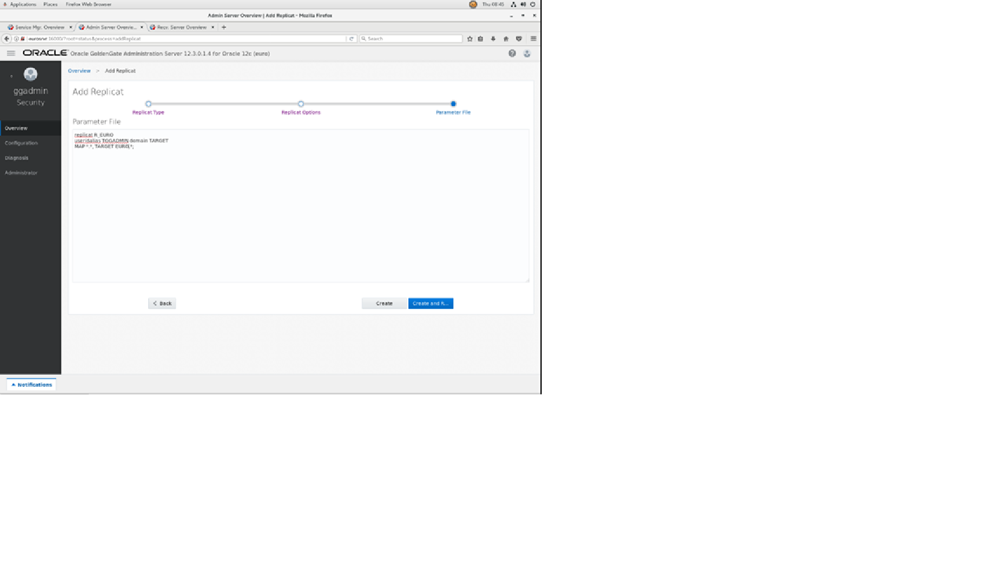

21.	Once created 

22.	You can check the statistics

23.	You can log in to Database and check the counts

24.	connecting to GG Admin client will require the same private key 

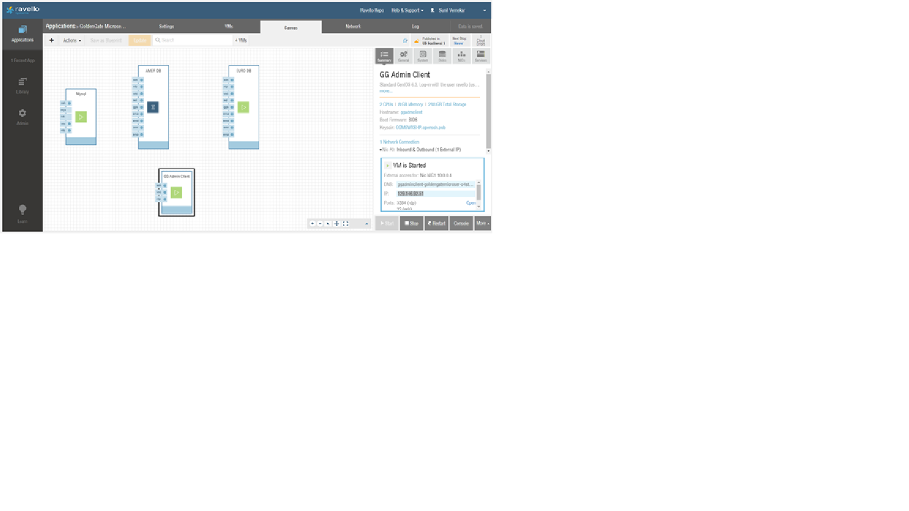

25.	you can check the same stats of replicat remotely from the admin client

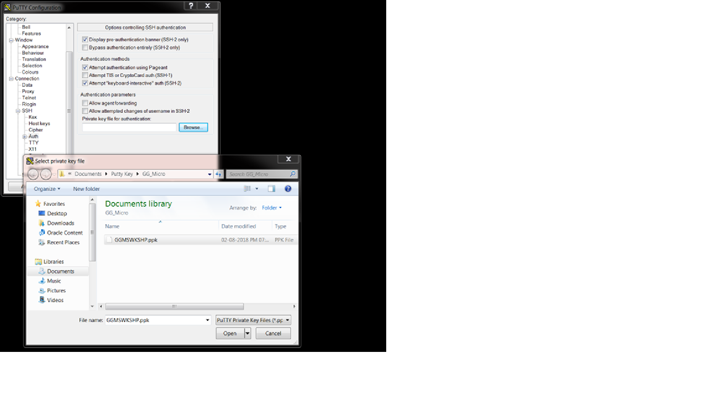
