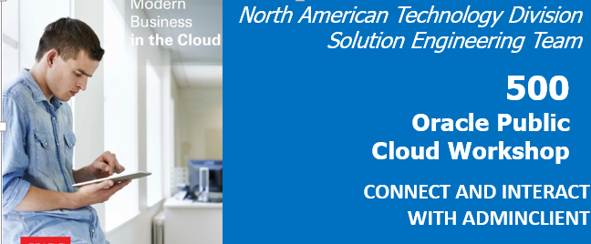

Update August 16, 2018

## CONNECT AND INTERACT WITH ADMINCLIENT
## Introduction

In this lab, you will take a look at how to connect and interact with the Microservices AdminClient. using Goldengate 12.3 micro services web interface in a Ravello environment.

Steps:
1. Open a command terminal (Figure 8-1).
Right mouse click -> Open Terminal

2. Navigate to the Oracle GoldenGate 12.3 Home /bin directory (Figure 8-2).
$ cd /opt/app/oracle/product/12.3.0.1/oggcore_1/bin

3. Start the AdminClient (Figure 8-3).
$ ./adminclient

4. Connect to Oracle GoldenGate without a deployment (Figure 8-4).
OGG 1> connect http://ogg123rs:16000 as oggadmin password
welcome1

Notice that you are not connected and that AdminClient provides you a list of deployment you can attempt to connect to.

5. Connect to an Oracle GoldenGate deployment (Figure 8-5).
OGG 2> connect http://ogg123rs:16000 deployment Atlanta_1
as oggadmin password welcome1

6. Perform an “info all” command and other GoldenGate commands to see what
AdminClient can do

OGG Atlanta_1 3> info all

Note: checkout the RLWRAP function as well (arrow up and down while in AdminClient)

At this point, you should have a fully functional Admin Client environment. 